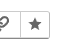
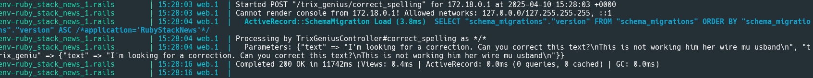
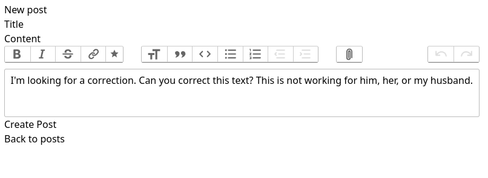

# ✨ TrixGenius (Alpha 0.1.0)

**TrixGenius** is a Rails engine and generator that extends the [Trix Editor](https://github.com/basecamp/trix) with enhanced functionality using Hotwire (Turbo + Stimulus). It adds AI-powered buttons to the Trix toolbar — including a **Correct Spelling** feature — to make rich-text editing smarter, more dynamic, and user-friendly.

## ⚙️ Features (Alpha)

- 🚀 **Plug-and-play generator** to scaffold Trix enhancements into your app.
- 🎛️ StimulusJS controller for rich interaction with Trix Editor.
- ✍️ **`Correct Spelling` button** — adds a toolbar button to trigger spelling corrections (via API or local logic).
- 🔌 Hooks ready for integration with services like DeepSeek AI.
- 🧪 Designed for customization and extension.

> ⚠️ This is an **alpha release**. APIs and behaviors are subject to change as we gather feedback.
> 

## Installation

1. Add the gem to your Gemfile: https://rubygems.org/gems/trix-genius

    ```ruby
    gem "trix_genius"
    ```

2. Install the gem:

    ```bash
    bundle install
    ```

3. Set up Action Text:

    ```bash
    bin/rails action_text:install
    ```

4. (Optional) Create a scaffold to test it out:

    ```bash
    bin/rails g scaffold Post title:string content:rich_text
    bin/rails db:migrate
    ```

5. Install TrixGenius into your app:

    ```bash
    bin/rails g trix_genius:install
    ```

## Usage

Once installed, your Trix editor will have an AI-enhanced **Correct Spelling** button.  
This is enabled by default and ready to use in any form where you use Action Text’s `rich_text_area`.

## Configuration

Make sure your `.env` or Rails credentials include the required key:

```bash
DEEPSEEK_API_KEY=your_api_key_here
```

## 🧠 Add a "Correct Spelling" Button to Trix

To enable the "Correct Spelling" button:

1. Make sure `trix-genius` is installed and your controller is connected.
2. The generator adds a `correct_spelling` button to the Trix toolbar via Stimulus.
3. Inside your `trix_genius_controller.js`, the `correctSpelling` method can trigger an AI call or local spellchecker logic.

### Example Trix Toolbar Button (HTML)

````html
<%= form.rich_textarea :content, rows: 4, data: { controller: "trix" }, class: ["block shadow-sm rounded-md border px-3 py-2 mt-2 w-full", {"border-gray-400 focus:outline-blue-600": post.errors[:content].none?, "border-red-400 focus:outline-red-600": post.errors[:content].any?}] %>
````
Press Button to Correct the text Spelling:








---

👨‍💻 **About the Author**  
Hi! I'm **Germán**, a passionate **Ruby on Rails developer** with experience in **AI-powered applications, StimulusJS, and open-source development**.  

📢 **Let's connect!**  
🔗 [Website](https://www.rubystacknews.com/)  
🐙 [GitHub](https://github.com/ggerman)  
💼 [LinkedIn](https://www.linkedin.com/in/germ%C3%A1n-silva-56a12622/)  
📧 [Get in Touch](https://rubystacknews.com/get-in-touch/)  


```
